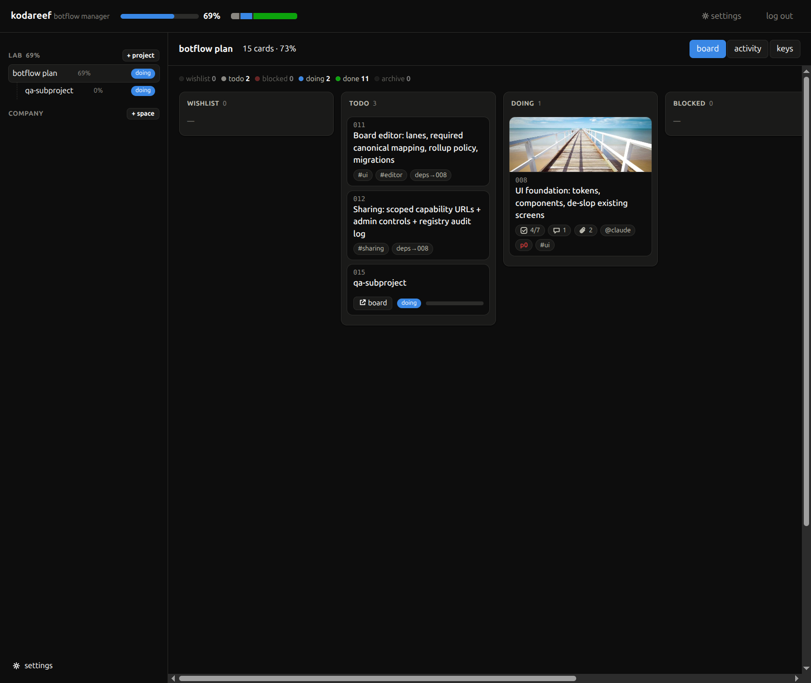
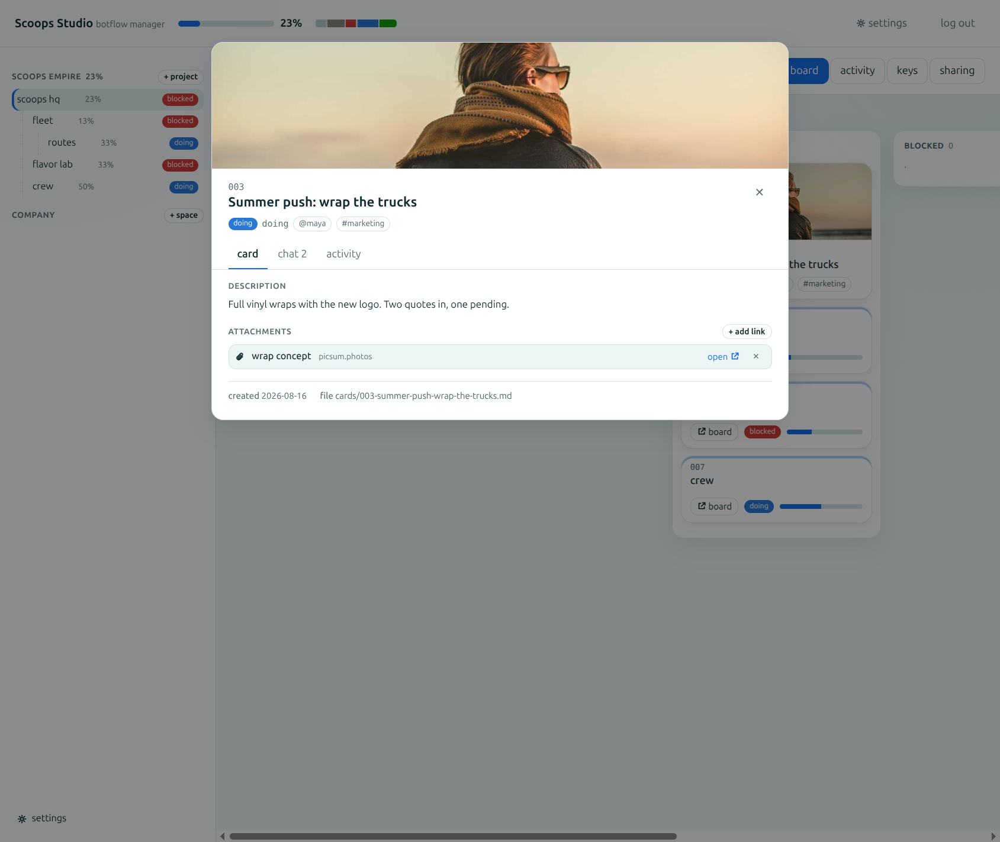
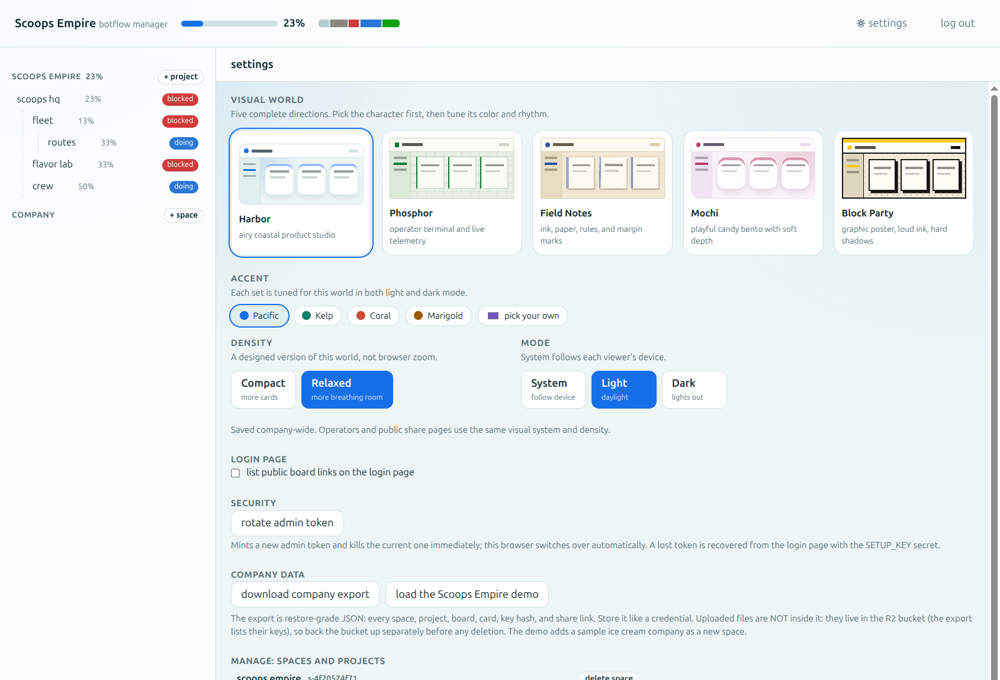
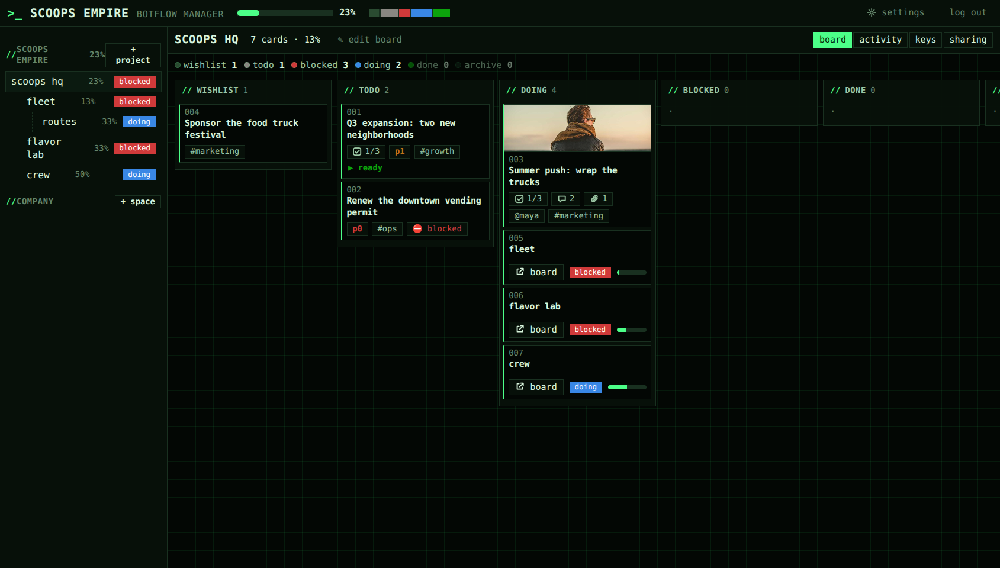

# botflow

**A workflow protocol your repo can carry.** Different agents, different workflows, one composable state model: every board, however specialized its lanes, projects onto six canonical states, so anything above it can aggregate it without knowing its shape.

```text
   security audit                 software project
   ──────────────                 ────────────────
   candidates                     backlog
   → reproduce                    → design
   → validate                     → implement
   → disclose                     → review
   → paid                         → ship
        │                              │
        ▼ projects onto               ▼ projects onto
   wishlist · todo · doing · blocked · done · archive
        │                              │
        └───────────────┬──────────────┘
                        ▼
                portfolio board
     rolls both up, blind to either one's shape
```

In practice that means **git-native kanban for AI agents**: a file format your repo carries, a CLI agents drive, a board humans read, and an optional self-hosted manager for the whole company.

## The idea

- **Boards are directories.** `board.yaml` (lanes, rules) + `cards/*.md` (one card, one file). Truth is plain files in git: history is your audit log, branches are workflow variants, merges are card merges.
- **Six canonical states**: `wishlist · todo · doing · blocked · done · archive`. Every custom lane declares which canonical state it projects onto (like Jira's status categories, but in a plain-text spec). That projection is what lets *any* two boards be aggregated, no matter how specialized their lanes are.
- **Cards can be boards.** A card with `type: board` contains another board (a subdirectory). Parents roll up children by canonical distribution: portfolio kanban without the parent ever knowing the child's shape. Progress is **structural**: every card is one unit of its board, and a sub-board fills its single unit by its own fraction, however many cards live inside it.
- **Lanes can be state machines.** `doing` may carry ordered substates (`design → implement → review`) with strict or free transitions; it still projects to `doing` from above.
- **Agents are the primary users.** `botflow ready`, `claim`, `mv`, `close`: plus an MCP server for MCP-native tools. An `AGENTS.md` one-liner ("run `botflow prime`") teaches any agent the workflow; in testing, a fresh agent given only that operated a board legally on the first try.
- **Workspaces are templates.** `botflow new <repo>[#branch] <dir>` shallow-copies a workspace template: board, playbook, environment batteries: so starting a project means instantiating a proven workflow shape. Branches carry specialty variants.
- **Zero runtime dependencies.** Node ≥ 24 built-ins only. The hosted manager runs on Cloudflare Workers + SQLite-backed Durable Objects under the same rule.

## Quickstart (repo-local)

```sh
botflow init                       # creates .botflow/ with the six canonical lanes
botflow card add "First task" --priority p1
botflow prime                      # workflow context: point agents here
botflow ready                      # unblocked todo work
botflow card claim 001 --actor me
botflow card close 001 --reason "done"
botflow board                      # terminal view · --json for machines
botflow serve                      # read-only web view on 127.0.0.1:4666
botflow setup claude               # wire the playbook into CLAUDE.md/AGENTS.md
```

Run from a checkout with `node src/cli/botflow.ts …` or link the bin (`npm link`).

### Structured card faces

Boards may register scoped label colors and typed custom fields without moving card
truth out of frontmatter:

```yaml
labels:
  - id: Type/Bug
    color: "#d03b3b"
fields:
  - id: sprint
    name: Sprint
    type: number
    face: true
  - id: risk
    name: Risk
    type: select
    options: [low, medium, high]
    face: true
```

`Type/Bug` and `Type/Feature` are mutually exclusive because they share the `Type`
group. Field values remain direct card keys (`sprint: 14`, `risk: high`), so older
readers preserve them. Create or edit them from the CLI with repeatable
`--field id=value`; use `--cover-color '#f0c040'` for a compact color band. The CLI,
MCP server, local viewer, hosted manager, and public shares use the same validation
and presentation data. Card faces show only filled `face` fields and unfinished
checklist previews; detail views keep everything.

### Templates, relationships, and batch authoring

Boards may also declare reusable card templates. Instantiation copies the
defaults into an ordinary card—there is no live template coupling—and
`{{title}}` is expanded in its initial markdown body:

```yaml
templates:
  - id: bug
    name: Bug report
    lane: todo
    labels: [Type/Bug]
    priority: p1
    estimate: 3
    body: "## Checklist\n- [ ] reproduce {{title}}\n- [ ] verify\n"
```

```sh
botflow card add "Login crash" --template bug
botflow card promote 012 2                       # checklist item → related card
botflow card link 012 019 --type relates         # writes the inverse too
botflow card link 012 'child#004' --type parent  # descendant board, target half first
botflow card merge 021 019                       # transfer attachments, archive duplicate
botflow card quick $'API *backend !p1\n  contract tests ^3'
botflow card bulk 012,019 mv doing
botflow card copy 012 --to-board .botflow/child
botflow card move-to 019 --to-board .botflow/child
```

Quick-add recognizes `*label`, `@assignee`, `!p0`–`!p3`, `today`,
`tomorrow`, `^estimate`, and `~template`; indentation creates parent/subtask
links, while quotes keep tokens literal. Typed relations are `relates`,
`duplicates`/`supersedes`, `parent`/`subtask`, and
`copied-from`/`copied-to`. Dependencies appear as active blocking edges and
degrade to resolved related edges when their target completes. Link/unlink accepts
a same-board id or a descendant-board card ref and writes the inverse target half
first, so retry converges after interruption. Hosted refs use
`project:<project-id>#<card-id>`; the manager's link dialog lists only the current
project and authorized descendants. Local and hosted boards draw same-board edges
as directional SVG connectors. Filesystem and hosted transfers are likewise
replay-safe and target descendant boards only, keeping every persisted cross-board
reference inside the loaded project tree. In the manager, nested boards also appear
as “wormhole” drop targets while dragging.

### Search, collaboration, and feeds

Search uses one grammar everywhere: bare terms match card text, quoted phrases stay
together, `-term` negates, and qualifiers narrow by fields such as `state:`, `lane:`,
`label:`, `assignee:`, `delegate:`, `watcher:`, `voter:`, `mention:`, `priority:`,
`due:`, and `field.<id>:`. Identity qualifiers accept `@me`; `is:ready`,
`is:blocked`, and `is:overdue` are derived from the same analyzed board agents use.

```sh
botflow query 'state:doing -label:Type/Docs "API repair"'
botflow query 'watcher:@me -state:done'
botflow filter save my-watch 'watcher:@me -state:done' --name 'My watch list'
botflow query --saved my-watch
botflow lane subscribe doing
botflow card watch 012
botflow card vote 012
botflow card boost 012 'ship it 🚀'
```

Saved filters and lane subscriptions are portable `board.yaml` data. Card watchers
and votes are idempotent frontmatter sets; `@mentions` are derived from descriptions
and comments; boosts are append-only entries capped at 12 Unicode characters. The
CLI, MCP server, local viewer, manager, public pages, and JSON views expose the same
collaboration data.

The manager can mint a personal, read-only capability feed for a whole project, one
lane, one card, or one saved filter. Each capability has Atom, RSS 2.0, and iCalendar
URLs. Slack's RSS subscriber supplies the first Slack path without OAuth; calendar
apps can subscribe to iCal. Feed URLs are member-scoped bearer secrets: they stop
immediately on revocation, lost project access, removed membership, or a deleted
scope. Calendar refresh cadence is controlled by the calendar provider.

### Scheduling, blockers, and bounded automation

Cards can carry UTC `start`/`due` values, due-relative reminder offsets, recurrence,
and snooze state. Recurrence creates an independent successor on close; snooze hides
otherwise-ready work until its UTC instant or genuine new card activity, whichever
comes first.

```sh
botflow card add "Weekly audit" --due 2026-09-01 --reminders 1440,60 \
  --repeat 1:week:due
botflow card snooze 012 --until 2026-08-24T13:00Z
botflow automate                         # reminder / wake / archive pass
```

Boards can define reusable blockers, WIP enforcement, safe buttons, and bounded event
rules in portable configuration:

```yaml
lanes:
  - id: review
    canonical: doing
    wip: 3
    wip_mode: justify       # allow · justify · deny
blockers:
  - id: external-review
    name: External review
    color: "#b42318"
buttons:
  - id: ship
    name: Ship
    scope: card
    action: move
    value: done
rules:
  - id: note-review
    event: enter
    lane: review
    action: label
    value: reviewed
automation:
  archive_done_after: 30
```

`justify` and forced `deny` overflow require a written Log reason. Named-blocked cards
cannot move until unblocked, and blocked duration is aggregated by blocker id. Buttons
are declarative move/close/label operations—never code or network calls—and board
buttons are capped at 100 filtered cards. Rules can only label, unlabel, assign,
delegate, or comment; they run in the primary transaction without recursion.

The CLI runs automation lazily before its work-discovery reads. Hosted projects do the
same on board fetch and schedule the next due action with a Durable Object alarm. The
state remains rebuildable: exact reminder markers and card Logs are the source of truth.

### Views, grouping, and manual uncertainty

The hosted manager, public board shares, and local read-only viewer can project the
same cards as a kanban board, sortable table, assignee/label/custom-field swimlanes,
due-date calendar, start/due timeline, field-grouped columns, a flow-metrics dashboard,
or a Hill Chart. Search and saved filters apply to the selected hosted layout too.
Metrics remain derived from card Logs: daily throughput, cumulative flow, cycle/lead
averages, active aging, WIP breaches, and blocked days by named reason.

Field-grouped columns support lane, assignee, delegate, priority, scoped label groups,
and declared `select`, `person`, or `checkbox` fields. Dropping a card into another
group performs the ordinary validated edit of that source field; grouping does not
create hidden rank or view state.

`hill: 0` through `hill: 100` is different by design. It is a manual uncertainty
signal: uphill (`0–49`) means the approach is still being figured out, `50` is the
crest, and downhill (`51–100`) means execution is understood. Nothing advances it
automatically. Drag its dot in the manager, or edit it explicitly:

```sh
botflow card edit 012 --hill 38
botflow card edit 012 --hill none
```

## Quickstart (template workspace)

```sh
botflow new https://github.com/you/workspace#review-gated my-project --name my-project
cd my-project && botflow prime
```

`templates/basic/` in this repo is a minimal template: a board plus an AGENTS.md playbook. Fork it, reshape the lanes for a specialty workload on a branch, and every future project of that shape is one `botflow new` away: kanban batteries included.

## Hosted manager (Cloudflare)

`worker/` is a self-hosted board manager: **Company → Spaces → Projects (projects own projects; a project is a board)** with a web UI at every level, **member accounts** for people and bots alike, and an append-only **audit log**. One SQLite-backed Durable Object per project serializes all writes; boards are stored in the exact same document format the CLI uses.

```sh
npm run dev:manager                # local: http://127.0.0.1:8787
npm run deploy:manager             # deploy to your Cloudflare account
npx wrangler secret put SETUP_KEY  # required before public first-run setup
```

The dev server is a **full local instance**: workerd with SQLite Durable Objects persisted
under `.wrangler/state/`, no Cloudflare account or network needed. Keep one running under a
supervisor for local testing (`pm2 start "npm run dev:manager -- --port 4700" --name
botflow-manager --cwd <repo>`); source changes hot-reload. Deleting `.wrangler/` resets the
instance: company, accounts, boards, everything. Loopback setup is intentionally zero-config;
an internet-hosted deployment refuses initialization until `SETUP_KEY` is configured as a
Worker secret. Deploy-button users can add it under **Settings → Variables and Secrets** in
the Cloudflare dashboard. Enter that value once in the setup form; it is not your password.
The same secret is the recovery path: "lost access?" on the login page resets an owner's
password (ending every live session), and anyone can change their own password from settings.
Both are audited.

[](https://deploy.workers.cloudflare.com/?url=https://github.com/kodareef5/botflow)
*(the button needs this repo public on GitHub; `wrangler deploy` works regardless)*

Visitors get a consumer pitch at `/about`, live public share links can optionally sit on the
login page (admin-controlled and off by default), and settings offers a one-click **Scoops Empire** demo
company plus a full **company export** (every space, project, board, and card as one
restore-grade JSON, including member records with password hashes, api key hashes, and share
links, plus active webhook and email integration configuration; store it like a credential,
because it is one). Delivery queues/history and uploaded bytes are separate operational data,
not part of that JSON. The demo source ships in
`demo/icecream-empire.json`.

The first visit creates the **owner** account: a username and a password, and nothing else.
A company name is optional (settings can rename it later), and the setup-key field only appears
on a deployment that actually requires one, so loopback development asks for two fields. From
the UI: create spaces and projects, add members, search and filter cards, collaborate,
subscribe to lanes, create personal feeds, and watch boards and activity live.

> **Legacy auth migration:** deployments from before member accounts deliberately reset
> authentication on their first upgrade to the members model. The old admin
> token and every `bfk_` agent key stop working, and a company export taken
> before that migration restores its boards but not its old project-keyed keys. Spaces, projects,
> boards, and cards are untouched: the instance reports itself uninitialized,
> you re-run setup behind `SETUP_KEY` to create the owner account, and
> everything is where you left it. Re-issue bot credentials from each member's
> account afterwards. Current additive card-feature and integration tables require no reset.

### Link previews (opt-in)

Set the `LINK_PREVIEWS` Worker var to `on` and an attached link contributes its Open Graph
picture as card art: a YouTube url hands over its thumbnail, and so does anything else that
ships `og:image`. The worker fetches the page once, caches the verdict per project, and
**proxies the picture from its own origin**, so a viewer's browser never contacts the site
being previewed — which matters on a public `/s/<token>` share page, where otherwise every
stranger you send a board to would be reported to whoever hosts the image.

It is off by default because it makes the worker fetch urls that members choose.
`unfurlTarget` refuses anything that is not publicly routable (loopback, RFC1918,
link-local including the cloud metadata endpoint, multicast, documentation/benchmark/
discard/site-local/unique-local IPv6, and decimal/octal/hex/compatible/mapped/transition
spellings of private IPv4), re-checks every redirect hop, caps size and
time, and only reads `text/html`. What it cannot see is DNS: a public hostname that
resolves to a private address passes the check. Cloudflare's edge will not route there, so
a deployed Worker is covered; a self-hosted `workerd` on a LAN is not, which is why you
turn this on rather than it being assumed.

### Webhooks and email bridges

Project owners can configure signed outbound webhooks and provider-neutral email from
the project's **Integrations** tab. Webhooks freeze a versioned event body, sign the
exact bytes with HMAC-SHA256, revalidate every redirect hop against the SSRF policy,
retry durably with backoff, open a circuit around dead endpoints, and retain paginated
delivery history for replay. Production webhook endpoints require HTTPS.

Email deliberately stops at a provider boundary. A constrained inbound capability can
only create a card or comment on one preselected card, with provider message-id dedupe.
Outbound notifications enter a leased outbox that the one bot named by the
`EMAIL_BRIDGE_USERNAME` Worker variable claims and acknowledges using its ordinary
project-scoped `bfk_` credential (unset is owner-only/fail-closed). The bridge—not botflow—owns the
mail provider, signature verification, SPF/DKIM, bounces, and deliverability. The exact
payloads, receiver verification algorithm, retry behavior, bridge API, and threat models
are documented in [Hosted integration contracts](docs/integrations.md).
Company export v4 preserves active integration configuration, including webhook signing
secrets and inbound route token hashes, while deliberately resetting delivery queues,
dedupe records, history, retries, and circuit state on restore.
The complete card-feature scope, migration decisions, security/accessibility audit, and
release evidence are in [Card feature release review](docs/card-features-review.md).

### Members, scopes, and roles

Everyone on a board is a member with a username and password. Humans and bots use the same
model; a bot is just a member with `kind: bot`.

- **Scope** is where a member can reach: the whole **company**, one **space** (every project
  in it), or one **project** and everything nested beneath it.
- **Role** is what they can do there: **read** (look, cannot touch), **write** (work the
  board), or **owner** (run the company: spaces, board shape, members, sharing, `force`).
- **Username is permanent** because it is the actor string written into every card's `## Log`
  and its `assignee`. **Display name is not**: renaming a member updates every board view at
  once, without rewriting a single card. Card history stays byte-stable and git-diff-clean.

A member holds a password and, optionally, any number of **api keys**. A key carries that
member's identity and scope and can be revoked on its own, which is what makes it the right
credential for CI. A key's label ("laptop", "CI runner") is a note to yourself, not an
identity: unnamed keys name themselves `api key #1`, `#2`, and so on, and renaming one changes
nothing on any board. An owner can manage a bot's keys directly from
**Settings → Members → keys**: list labels and usage dates, mint, rename, revoke, or
atomically replace a credential. A minted or replacement secret is shown once; token
material is never returned by later listings, so the owner never has to sign in as the bot.

So a bot can authenticate three ways, all resolving to the same identity:

```sh
curl -u scout:… https://manager.example.workers.dev/api/whoami   # its own credentials
curl -H 'authorization: Bearer bfk_…' …                          # an api key
curl -H 'authorization: Bearer bfu_…' …                          # a session from /api/login
```

Link a repo board and sync snapshots (`BOTFLOW_TOKEN` takes an api key):

```sh
botflow remote add https://manager.example.workers.dev p-abc123
BOTFLOW_TOKEN=bfk_… botflow push   # or pull
```

Hosted actions are always logged under the authenticated member: a request body cannot name a
different actor, so `botflow push --actor X` is ignored by the manager (it still applies to a
local board).

Binary attachment uploads are opt-in: create an R2 bucket and bind it as `ATTACHMENTS`
(one commented line in `wrangler.jsonc`, or the dashboard). The UI lights up an upload
button; files land in R2, cards record a normal markdown attachment line pointing at
`/files/…`, images join the gallery and cover art, and deleting a project purges its
files. Without the binding everything else works and uploads simply stay hidden.
Note that the company export carries a manifest of uploaded keys but not the bytes:
back the bucket up separately (`wrangler r2 object get`, rclone, or dashboard tools)
before deleting anything whose files you want to keep. Uploaded file URLs are permanent
bearer capabilities (128-bit random keys): anyone holding a URL can fetch that file, and
revoking a share link does not revoke file URLs that were already copied.

The sync contract: your repo's documents are truth, and sync is a whole-board snapshot
(last write wins). The hosted board is that snapshot plus a manager overlay: sub-projects
created in the manager survive a push even though your repo never carried them. Both
directions validate the entire snapshot before writing anything, every write is
crash-safe, and `pull` refuses to overwrite uncommitted board changes unless you pass
`--force`. An interrupted pull leaves only valid files; re-running it converges.

## What it looks like

The manager includes five complete visual worlds: Harbor, Phosphor, Field Notes,
Mochi, and Block Party. Each has four tuned accents, light and dark modes, and
purpose-built compact or relaxed density. The workflow stays familiar while the
character, color, type, shape, and rhythm change together.

<p align="center">
  
</p>
<p align="center">
  
  
</p>
<p align="center">
  
</p>

## Layout

| Path | What |
|---|---|
| `spec/SPEC.md` | The format spec: the real product |
| `test/fixtures/` | Golden boards; the spec's conformance vectors |
| `src/core/` | Engine: parse → model → lint → project → rollup, pure ops |
| `src/cli/` | The `botflow` CLI (incl. push/pull sync) |
| `src/mcp/` | MCP server (stdio JSON-RPC, 33 tools) |
| `src/viewer/` | Read-only local board UI (`botflow serve`, `board --html`) |
| `worker/` | Cloudflare manager: registry DO + project DOs + operator UI |
| `templates/basic/` | Workspace template ("kanban batteries") |
| `.botflow/` | This repo's own board: botflow built itself on botflow |

Verify a checkout with `node --run test` (node:test, no deps) and `node --run typecheck`.

## Prior art

Built on the shoulders of: [Backlog.md](https://github.com/MrLesk/Backlog.md) (md-file-per-task conventions), [beads](https://github.com/steveyegge/beads) (`ready`/`prime`/claim verbs for agents), Jira status categories & Linear status types (canonical projection), [Portfolio Kanban](https://www.nimblework.com/kanban/portfolio-kanban/) (board-of-boards rollup), [AGENTS.md](https://agents.md/) (repo-describes-how-to-act), [degit](https://github.com/Rich-Harris/degit)/cookiecutter (template instantiation), [git-bug](https://github.com/git-bug/git-bug) (what git-as-database can be), [Tokanban](https://tokanban.com/) (agent/operator split on Cloudflare actors). None combine files-in-git truth, canonical projection, recursive boards, an agent-first CLI, template instantiation, and a self-hostable multi-level manager: that composite is botflow.

## License

MIT
